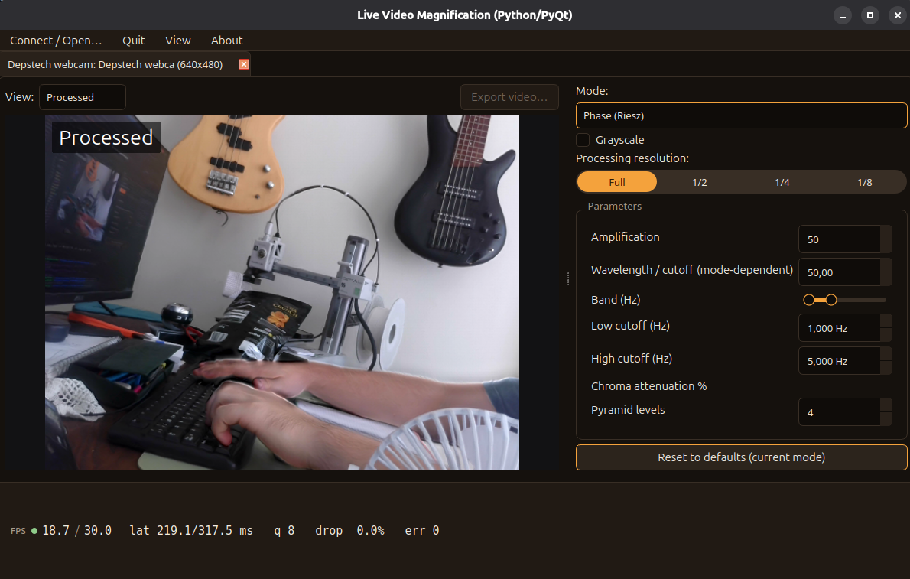

# Live-Video-Magnification-Python



A **Python/PyQt6 port** of [Live-Video-Magnification](https://github.com/tschnz/Live-Video-Magnification)
by [tschnz](https://github.com/tschnz), originally written in C++/Qt with OpenCV.

Real-time Eulerian video magnification: it reveals motion and colour changes
that are invisible to the naked eye — a pulse in the skin of a face, the
vibration of a loaded structure — from an ordinary camera or a video file.

## Why this fork

The original project is an excellent C++/Qt application, but building it
requires a Qt development environment, CMake and vcpkg. This port trades some
raw performance for a much shorter path from clone to running code, and for a
codebase that is easier to read, instrument and extend when experimenting with
new magnification algorithms.

What the port keeps and what it changes:

| | Original | This port |
|---|---|---|
| Language | C++17 | Python 3.10+ |
| GUI | Qt5 (widgets, `.ui` files) | PyQt6, widgets built in code |
| Build | CMake + vcpkg | `pip install -r requirements.txt` |
| Architecture | `QThread` workers | same design: capture and processing threads |
| Algorithms | Laplacian pyramid (colour + motion), Riesz pyramid (phase-based) | ported one to one |

The module structure deliberately mirrors the original so that the two can be
read side by side:

| This port | Original |
|---|---|
| `magnificator.py` | `Magnificator.cpp` |
| `riesz_pyramid.py` | `RieszPyramid.cpp` |
| `temporal_filter.py` | `TemporalFilter.cpp` |
| `spatial_filter.py` | `SpatialFilter.cpp` |
| `workers.py` | `CaptureThread.cpp`, `ProcessingThread.cpp` |
| `mat_to_qimage.py` | `MatToQImage.cpp` |
| `ui/` | `MainWindow.cpp`, `CameraView.cpp`, `MagnifyOptions.cpp` … |

Algorithms are unchanged from the original, which implements the methods of
Wu *et al.* (Eulerian Video Magnification, SIGGRAPH 2012) and Wadhwa *et al.*
(Riesz pyramids, ICCP 2014).

## Install and run

```bash
git clone https://github.com/agarnung/Live-Video-Magnification-Python.git
cd Live-Video-Magnification-Python

python3 -m venv .venv
source .venv/bin/activate
pip install -r requirements.txt

python main.py
```

Requires Python 3.10 or newer. Dependencies: PyQt6, OpenCV, NumPy, SciPy.

## Usage

1. **File → Open camera** (or open a video file).
2. Pick a magnification mode in the options panel: colour, motion (Laplacian)
   or phase-based (Riesz).
3. Set the temporal band, the amplification factor and the number of pyramid
   levels. Useful starting points:

| Target | Band (Hz) | Amplification | Mode |
|---|---|---|---|
| Facial pulse (colour) | 0.8 – 1.5 | 50 – 150 | Colour |
| Small motion | 0.5 – 3.0 | 10 – 30 | Motion / Riesz |
| Structural vibration | 5 – 15 | 5 – 20 | Riesz |

A region of interest can be selected by dragging on the image, which cuts the
cost considerably at high resolutions.

## Troubleshooting

**The camera does not open.** Check which indices actually deliver frames — not
every `/dev/videoN` is a usable camera; on many laptops the odd indices are
metadata nodes:

```bash
python3 -c "
import cv2
for i in range(6):
    c = cv2.VideoCapture(i, cv2.CAP_V4L2)
    if c.isOpened():
        ok, _ = c.read()
        print(f'index {i}: opens=True delivers_frame={ok}')
        c.release()
"
```

**Qt font warnings on startup** (`QFontDatabase: Cannot find font directory`).
Harmless messages from the Qt backend bundled with `opencv-python`; they do not
affect the application. Silence them with
`QT_LOGGING_RULES='*=false' python main.py`.

**Wayland session issues.** Force the X11 backend:
`QT_QPA_PLATFORM=xcb python main.py`.

**Low frame rate.** Reduce the number of pyramid levels, select a region of
interest, or lower the capture resolution. Python carries an interpreter
overhead the C++ original does not.

## Credits and licence

All credit for the original design and implementation goes to **Jens Schindel**
([tschnz](https://github.com/tschnz)) —
[Live-Video-Magnification](https://github.com/tschnz/Live-Video-Magnification),
Copyright (C) 2015. This repository is a language port, not new research.

The original is licensed under the **GNU General Public License v3.0**. As a
derivative work this port remains under a compatible copyleft licence: it is
distributed under the **GNU Affero General Public License v3.0** — see
[`LICENSE`](./LICENSE). Either way the copyleft terms apply: the source must
remain available and derivative works must carry the same licence.

## References

- H.-Y. Wu, M. Rubinstein, E. Shih, J. Guttag, F. Durand, W. Freeman,
  *Eulerian Video Magnification for Revealing Subtle Changes in the World*,
  ACM Trans. Graph. 31(4), 2012. [Project page](https://people.csail.mit.edu/mrub/evm/)
- N. Wadhwa, M. Rubinstein, F. Durand, W. T. Freeman,
  *Riesz Pyramids for Fast Phase-Based Video Magnification*, ICCP 2014.

## TODO

- **Track upstream.** The original project has received major updates since this
  port was branched off, so the port is currently behind. Review the changes in
  [tschnz/Live-Video-Magnification](https://github.com/tschnz/Live-Video-Magnification)
  and carry the relevant ones across.